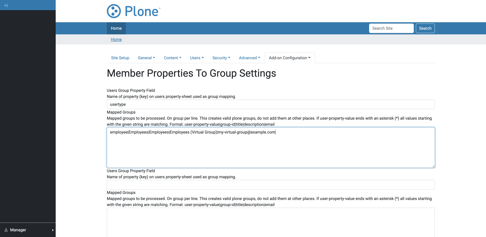
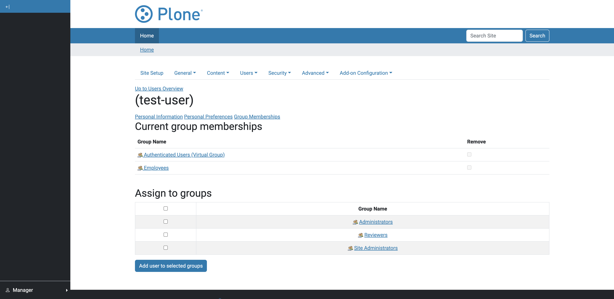
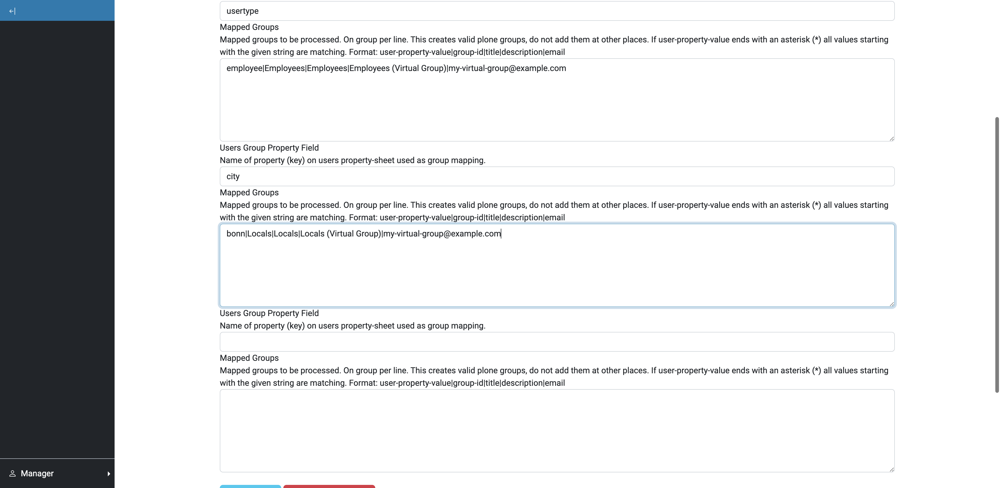
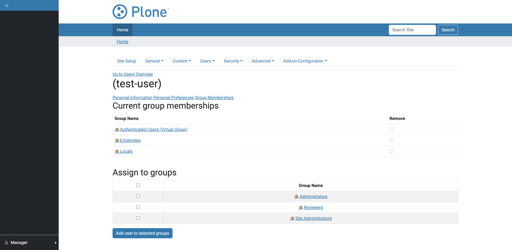

Create virtual groups based on member properties
------------------------------------------------

**As administrator I can create a group based on member properties**

.. literalinclude:: ../../../src/pas/plugins/memberpropertytogroup/tests/robot/test_acceptance.robot
  :language: robot
  :lines: 42-46

**Given**

* a user with the property 'usertype' = 'employee'
* a logged-in manager

**When**

* I create a virtual group 'Employees' with the property 'usertype' = 'employee'.

**Then**

* the user is member of the group 'Employees'

Create multiple virtual groups based member properties
------------------------------------------------------

**As administrator I can create a group based on multiple member properties**

.. literalinclude:: ../../../src/pas/plugins/memberpropertytogroup/tests/robot/test_acceptance.robot
  :language: robot
  :lines: 55-64

**Given**

* a user 'John Doe' with the property 'usertype' = 'employee'
* a user 'Jane Doe' with the property 'city' = 'bonn'
* a logged-in manager

**When**

* I create a virtual group 'Employees' with the property 'usertype' = 'employee'
* I add another virtual group 'Locals' with the property 'city' = 'bonn' in slot 1

**Then**

* the user 'John Doe' is member of the group 'Employees'
* the user 'Jane Doe' is member of the group 'Locals'

Create virtual group based on a member properties prefix
--------------------------------------------------------

**As administrator I can create a group based on member properties prefixes**

.. literalinclude:: ../../../src/pas/plugins/memberpropertytogroup/tests/robot/test_acceptance.robot
  :language: robot
  :lines: 65-69

**Given**

* a user with the property 'student_id' = '1234567'
* a logged-in manager

**When**

* I create a virtual group 'Students' with the property 'student_id' = '123*'

**Then**

* the user is member of the group 'Students'

.. image:: ../_screenshots/the-user-is-member-of-the-group.png
   :alt: MemberPropertyToGroup Control Panel
   :align: center
