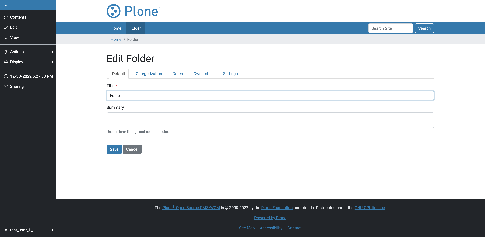

Grant local permissions based on virtual member properties groups
-----------------------------------------------------------------

**As reviewer I can grant permissions based on member properties groups**

.. literalinclude:: ../../../src/pas/plugins/memberpropertytogroup/tests/robot/test_acceptance.robot
  :language: robot
  :lines: 48-52

**Given**

* a user with the property 'usertype' = 'employee'
* a virtual group 'Employees' with the property 'usertype' = 'employee'

**When**

* I grant the virtual group the 'edit' permission on a folder.

.. image:: ../_screenshots/grant-virtual-group-permission-on-folder.png
   :alt: MemberPropertyToGroup Control Panel
   :align: center

**Then**

* the user can edit the folder.

