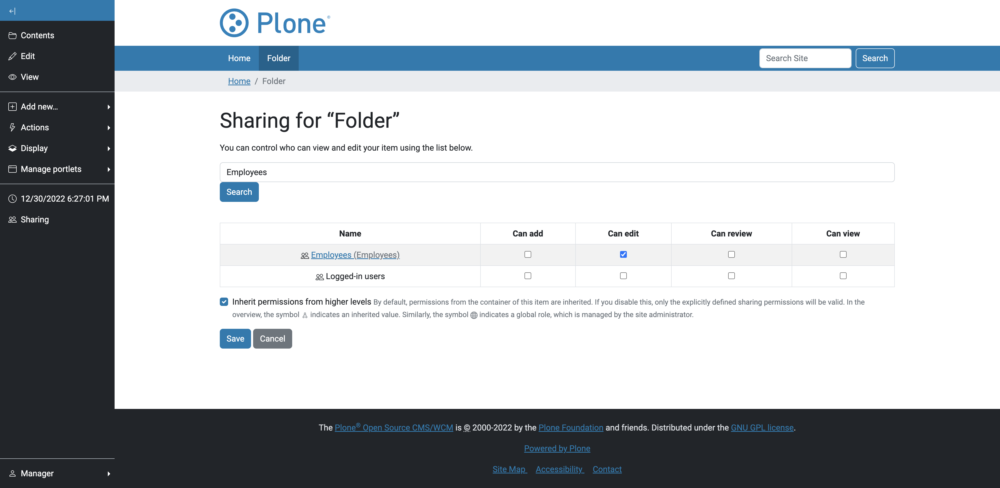

Features
==============================================================================

As administrator I can create a group based on member properties
----------------------------------------------------------------

.. literalinclude:: ../../src/pas/plugins/memberpropertytogroup/tests/robot/test_acceptance.robot
  :language: robot
  :lines: 47-71

When I create a virtual group 'Employees' with the property 'usertype' = 'employee'.

.. image:: _screenshots/memberpropertytogroup-controlpanel.png
   :alt: MemberPropertyToGroup Control Panel
   :align: center

Then the user is member of the group 'Employees'

.. image:: _screenshots/the-user-is-member-of-the-group.png
   :alt: MemberPropertyToGroup Control Panel
   :align: center

As reviewer I can grant permissions based on member properties groups
---------------------------------------------------------------------

.. literalinclude:: ../../src/pas/plugins/memberpropertytogroup/tests/robot/test_acceptance.robot
  :language: robot
  :lines: 48-53

When I grant the virtual group the 'edit' permission on a folder.

Then the user can edit the folder.

.. image:: _screenshots/the-user-can-edit-the-folder.png
   :alt: MemberPropertyToGroup Control Panel
   :align: center

As administrator I can create a group based on multiple member properties
-------------------------------------------------------------------------

.. literalinclude:: ../../src/pas/plugins/memberpropertytogroup/tests/robot/test_acceptance.robot
  :language: robot
  :lines: 55-63

As administrator I can create a group based on member properties prefixes
-------------------------------------------------------------------------

.. literalinclude:: ../../src/pas/plugins/memberpropertytogroup/tests/robot/test_acceptance.robot
  :language: robot
  :lines: 65-69
